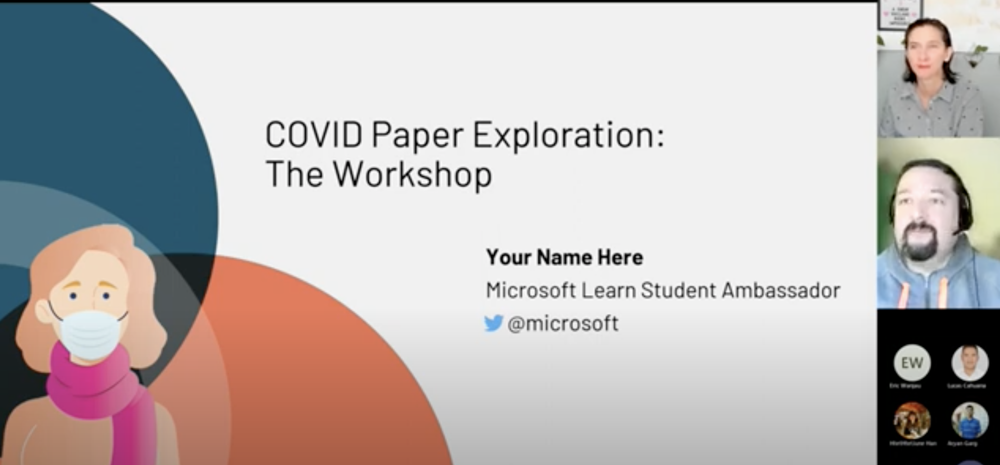
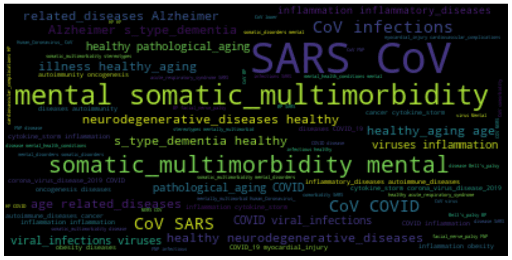
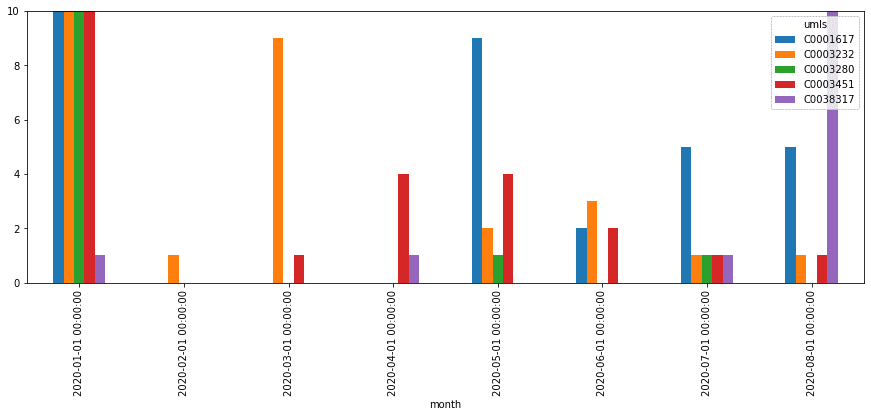
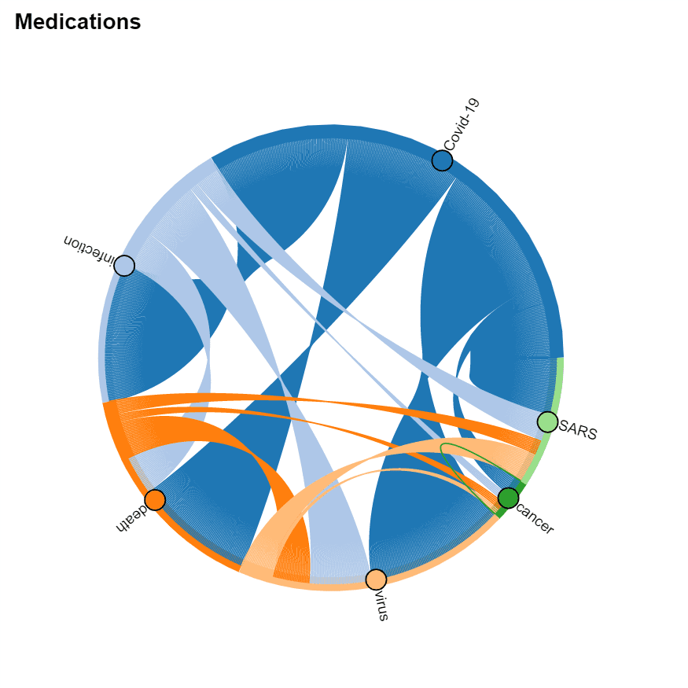

# COVID Paper Exploration Workshop

This workshop explores the use of [Azure Text Analytics](https://azure.microsoft.com/services/cognitive-services/text-analytics/?WT.mc_id=academic-49822-dmitryso) and [Text Analytics for Health](https://docs.microsoft.com/azure/cognitive-services/language-service/text-analytics-for-health/overview/?WT.mc_id=academic-49822-dmitryso) to get some insights from a large corpus of COVID medical papers. 

| **Project Goal**              | Learn how to use AI Text Analytics to extract meaningful visual insights from text |
| ----------------------------- | --------------------------------------------------------------------- |
| **What will you learn**       | How to use Azure Text Analytics Cognitive Service, How to process tabular data in Python using Pandas and visualize them using different visualization techniques |
| **What you'll need**          | [Azure Subscription](https://azure-for-academics.github.io/getting-azure/), ability to run [Jupyter Notebooks](https://soshnikov.com/education/how-to-execute-notebooks-from-github/) |
| **Duration**                  | *1-1.5 hours*                                                                |
| **Just want to try the app or see the solution?** | [COVIDPaperExploration.ipynb](solution/COVIDPaperExploration.ipynb) |
| **Slides** | [Powerpoint](slides.pptx), [SpeakerDeck](https://speakerdeck.com/shwars/covid-paper-exploration-the-workshop) |
| **Author** | [Dmitry Soshnikov](http://soshnikov.com) |

> This workshop is based on the following publication: [arXiv:2110.15453](https://arxiv.org/abs/2110.15453). You can also refer to [this blog post](https://towardsdatascience.com/analyzing-covid-medical-papers-with-azure-machine-learning-and-text-analytics-for-health-c87ab621a3d0) for an overview of a larger paper exploration project.

🎥 Watch Microsoft Student Ambassadors [give this workshop](https://www.youtube.com/watch?v=B_Z4qnYtnoU)!

## Video walk-through

[](https://youtu.be/fpP2JVn-6OY "workshop walk-through")
> 🎥 Click this image to watch Dmitry walk you through the workshop

## What students will learn

In this project, you will automatically process texts of COVID-related scientific papers to draw some meaningful visual insights, such as: 

 - Which medications are mostly discussed and why
 - How strategies of COVID treatment changed over time
 - How symptoms are related to different diagnoses
 - Which medications are often used together


## Prerequisites

For this workshop:

1. You need to have an [Azure Account](https://azure-for-academics.github.io/getting-azure/). You may have one from your university, otherwise get [Azure for Students](https://azure.microsoft.com/free/students/?WT.mc_id=academic-49822-dmitryso), [GitHub Student Developer Pack](https://education.github.com/pack) or an [Azure Free Trial](https://azure.microsoft.com/free/?WT.mc_id=academic-49822-dmitryso).
> Learn more about creating an Azure Account at [Microsoft Learn](https://docs.microsoft.com/learn/modules/create-an-azure-account/?WT.mc_id=academic-49822-dmitryso)
1. You need to be able to run [Jupyter Notebooks](https://jupyter.org/). Read more on different options [in this blog post](https://soshnikov.com/education/how-to-execute-notebooks-from-github/):
    - Install Python locally and use Visual Studio Code with Python extension
    - Use [GitHub Codespaces](https://github.com/features/codespaces)

> Jupyter Notebooks offer a great way to combine Python code together with text and visualizations, creating **executable documents**. You can work with Jupyter Notebook either through the browser, or via tools such as Visual Studio Code. To be able to run code, you need to have a Python environment installed, either on your local computer, or in the cloud.

## Milestone 1: Getting the Dataset

Let's begin by [getting a dataset](data/README.md) of COVID medical papers. You need to replace the `data/metadata.csv` sample file with the full version of the dataset [from Kaggle](https://www.kaggle.com/allen-institute-for-ai/CORD-19-research-challenge?select=metadata.csv). 

> *Read more about this process [here](data/README.md). You may need to register on Kaggle.com, but that will be useful for your future career.*
## Milestone 2: Running Jupyter and Exploring the Data

After you get the data, you need to open [COVIDPaperExploration.ipynb](COVIDPaperExploration.ipynb) or [COVIDPaperExplorationDetailed.ipynb](COVIDPaperExplorationDetailed.ipynb) notebook and start writing code there, following the instructions inside the notebook.

**Note**: There are two versions of the notebooks provided, and you can chose the one most suitable to you:

* [COVIDPaperExploration.ipynb](COVIDPaperExploration.ipynb) contains only brief descriptions of milestones, and you have the freedom to write most of the code yourself
* [COVIDPaperExplorationDetailed.ipynb](COVIDPaperExplorationDetailed.ipynb) contains more detailed instructions, and you need to fill in the most important parts of the code, but the overall flow is created for you.

There is also a [notebook with the solution](solution/COVIDPaperExploration.ipynb), which you can consult should you experience a problem you are not able to solve. However, we suggest you to try and solve all the problems yourself, using [stack overflow](http://stackoverflow.com/) as a reference to find solutions. 

> Different options to run Jupyter Notebooks are described [in this blog post](https://soshnikov.com/education/how-to-execute-notebooks-from-github/).

As a result of this step, you should get all the paper data loaded into a *Pandas DataFrame*, and filter out only those papers that were published after January 2020. You may plot a histogram of publication frequencies:


<table border="0"><tr><td>
</td><td><b>Pandas</b> is a very frequently used Python library to manipulate tabular data. You can <a href="https://github.com/microsoft/Data-Science-For-Beginners/tree/main/2-Working-With-Data/07-python">read more</a> about using Pandas for data processing in our <a href="https://github.com/microsoft/Data-Science-For-Beginners/">Data Science for Beginners Curriculum</a>.
</td></tr></table>

## Milestone 3: Creating and Using Text Analytics Endpoint

At this point, you should have your Azure subscription ready. Start by logging into the [Azure Portal](http://portal.azure.com/?WT.mc_id=academic-49822-dmitryso).

Then, create an [Azure Cognitive Service for Language](https://docs.microsoft.com/azure/cognitive-services/language-service/overview/?WT.mc_id=academic-49822-dmitryso) cloud resource. You can start creating the resource by clicking [**HERE**](https://ms.portal.azure.com/#create/Microsoft.CognitiveServicesTextAnalytics) - it will take you to the corresponding page on the Azure Portal.

> Make sure to select **S - Standard** pricing tier, because Health Analytics is not available under the Free Tier.

Once you have created the resource, you should go to the portal and copy **Endpoint URL** and **Access key** into the notebook:

```python
endpoint = 'https://myservice.cognitiveservices.azure.com/' 
key = '123456789b44bb987c60af9aff34f63' 
```

To call the service, we first create the endpoint:
```python
from azure.core.credentials import AzureKeyCredential
from azure.ai.textanalytics import TextAnalyticsClient

text_analytics_client = TextAnalyticsClient(
    endpoint=endpoint, 
    credential=AzureKeyCredential(key))
```
And then we can call the service, passing batches of up to 10 documents at a time:
```python
inp = [document_1,document_2,...]
poller = text_analytics_client.begin_analyze_healthcare_entities(inp)
res = list(poller.result())
```

After this step, you should be able to process a bunch of abstracts and produce the list of entities with corresponding types, like this:
```
Dexmedetomidine (MedicationName)
improve (Course)
organ dysfunction (SymptomOrSign)
critically (ConditionQualifier)
ill (Diagnosis)
randomized controlled trial (AdministrativeEvent)
Dexmedetomidine (MedicationName)
Sepsis (Diagnosis)
...
``` 

## Milestone 4: Processing Abstracts

Now it's time to go big and process abstracts at scale! However, because we are limited in time, and we do not want to waste your cloud resources, we will process only a limited number of random abstracts (say, 200-500). 

Keep in mind that some abstracts are not present (they will have 'NaN' ) in the corresponding **abstract** field.

> It is important to select abstracts randomly, because later on we will want to explore the change is treatment tactics over time, and we need to have uniform paper representation across all time period. Alternatively, to further minimize time/spend, you can select a time sub-interval (say, only year 2020), and then process random papers in that interval. 

Spend some time thinking about the way you will store the result of processing. You can add processing results as additional columns to the DataFrame, or you can use separate list/dictionary.

> You want to make sure that for each paper you keep essential info such as title and publication time, together with all entities and relations.

Processing can take quite a long time. You may start (and proceed until the end of the workshop) with small sample size (~50 papers) to make sure your code works and your data structure is right, and then increase the sample size to 200-500 towards the end to obtain the results. 

> If you are really short on time, you can skip this step and load the results of processing random 500 papers from `data\processed.pkl.bz2` file using the following code:

```python
import pickle, bz2

with bz2.BZ2File('data\processed.pkl.bz2','r') as f:
    store = pickle.load(f)
```

## Milestone 5: Get Top Symptoms, Medications and Diagnoses

Now it is time to process our raw data and get some insights! Let's start by grouping entities together by their ontology ID (UMLS ID) and seeing which are the top mentions in different categories. As a result, you should build a table similar to the following:

| UMLS ID | Name | Category | Count |
|---------|------|----------|-------|
| C0020336 | hydroxychloroquine | MedicationName | 99 |
| C0008269 | chloroquine | MedicationName | 43 |
| C0939237 | lopinavir + ritonavir | MedicationName | 28 |
| ... | ... | ... | ...

You can also build a word cloud of diagnoses, symptoms or medications:



## Milestone 6: Visualize Change in Treatment Strategies

In addition to calculating the total count of mentions, you can see how they are distributed by month, and thus detect changes in treatment strategies. Select top medications/strategies and compute the distribution of their mentions by months (or weeks). First, get the list of top-5 UMLS IDs for medications and medication classes (AKA treatment strategies), and then use only those classes to plot graphs similar to the following:




## Milestone 7: Visualize Co-occurrence of Terms

It is interesting to see which terms occur together within one paper, because it can give us an idea about relationships between, for example, diagnoses and medications, or symptoms and treatments. You should also be able to see which medications are often used together, and which symptoms occur together.

You can use two types of diagrams for that:

* **Sankey diagram** allows us to investigate relations between two types of terms, eg. diagnosis and treatment
* **Chord diagram** helps to visualize co-occurrence of terms of the same type (eg. which medications are mentioned together)

To plot both diagrams, we need to compute the co-occurrence matrix, which in the row i and column j contains the number of co-occurrences of terms i and j in the same abstract (one can notice that this matrix is symmetric).

To actually plot the diagrams, we can use the [Plotly](https://plotly.com/python/) graphics library. This process is well described [here](https://plotly.com/python/sankey-diagram/). For the Chord diagram, you can use [Holoviews](https://holoviews.org/)

 | 
----|----

## Next steps

If you want to learn more:

* MS Learn Learning Path: [Microsoft Azure AI Fundamentals: Explore natural language processing](https://docs.microsoft.com/learn/paths/explore-natural-language-processing/?WT.mc_id=academic-49822-dmitryso)
* Read more about full-scale project on analyzing COVID dataset using CosmosDB/PowerBI/AzureML in [this blog post](https://soshnikov.com/science/analyzing-medical-papers-with-azure-and-text-analytics-for-health/)
* If you are planning to use this approach in your research, cite this paper [arXiv:2110.15453](https://arxiv.org/abs/2110.15453)

## Practice

The knowledge extraction that we have performed in this workshop was possible thanks for Text Analytics for Health service, which did most of the job for us. For different knowledge domains, you would need to train your own NER neural network model, and for that you will also need a dataset. The [Custom Named Entity Recognition](https://docs.microsoft.com/azure/cognitive-services/language-service/custom-named-entity-recognition/overview/?WT.mc_id=academic-49822-dmitryso) service can help you do that. 

However, the [Text Analytics Service](https://azure.microsoft.com/services/cognitive-services/text-analytics/?WT.mc_id=academic-49822-dmitryso) has some pre-built [entity extraction mechanism](https://docs.microsoft.com/azure/cognitive-services/language-service/named-entity-recognition/concepts/named-entity-categories/?WT.mc_id=academic-49822-dmitryso), as well as keyword extraction. As an additional challenge, experiment with text from a different problem domain, and see if you can extract some meaningful insights from them.

Things you can build:

* Analyze a blog or social network posts and get the idea of different topics that author is writing about. See how interests change over time, as well as the mood. You can use the blog of [Scott Hanselman](https://www.hanselman.com/) that goes back to [2002](https://www.hanselman.com/blog/archive/2002).
* Analyze [COVID 19 twitter feed](https://github.com/thepanacealab/covid19_twitter) to see if you can extract changes in major topics on twitter. 
* Analyze your e-mail archive to see how the topics you discuss and your mood change over time. Most e-mail clients allow you to export your e-mails to plain text or CSV format (here is an [example for Outloook](https://support.microsoft.com/office/import-and-export-outlook-email-contacts-and-calendar-92577192-3881-4502-b79d-c3bbada6c8ef/?WT.mc_id=academic-49822-dmitryso)).

## Feedback

Be sure to give [feedback about this workshop](https://forms.office.com/r/MdhJWMZthR)!

[Code of Conduct](../CODE_OF_CONDUCT.md)

