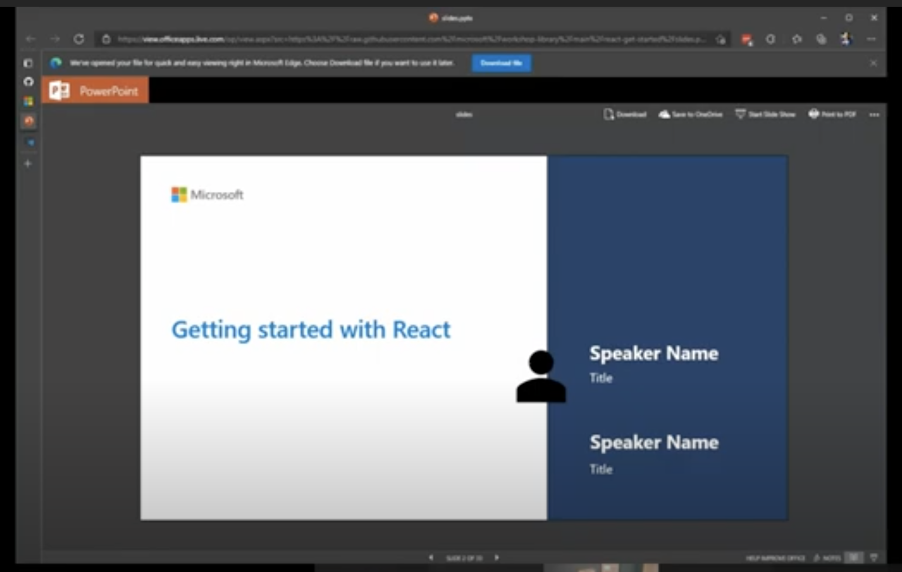

# Get Started with React

## Module Source

This workshop is based on the [Getting started with React](https://docs.microsoft.com/learn/modules/react-get-started/?WT.mc_id=academic-56602-chrhar) module on Microsoft Learn. All of the steps the attendees will follow to complete the workshop are contained in the module.

## Goals

In this workshop, you will learn how to build a web application with React.

| **Goal**                                          | **Description**                                                                                                       |
| ------------------------------------------------- | --------------------------------------------------------------------------------------------------------------------- |
| **What will you learn**                           | React concepts, JSX, and how to create your first component                                                           |
| **What you'll need**                              | [Visual Studio Code](https://code.visualstudio.com?WT.mc_id=academic-56602-chrhar), [Node.js](https://nodejs.org/) and [Git](https://git-scm.com/) |
| **Duration**                                      | 1 hour                                                                                                    |
| **Just want to try the app or see the solution?** | [Solution files](solution)                                             |
| **Slides**                                        | [Powerpoint](./slides.pptx)                                                                                             |

## Video walk-through

> 🎥 Click this image to watch Christopher walk you through the workshop

## Pre-Learning

- [Create a new Node.js project and work with dependencies](https://docs.microsoft.com/learn/modules/create-nodejs-project-dependencies/?WT.mc_id=academic-56602-chrhar)

## Prerequisites

- Software
  - [Visual Studio Code](https://code.visualstudio.com?WT.mc_id=academic-56602-chrhar)
  - [Node.js](https://nodejs.org/)
  - [Git](https://git-scm.com/)
- Experience
  - Have created HTML pages and used CSS for style
  - Written basic JavaScript applications
  - Created a project and managed packages using npm

## What students will learn

React is a popular front-end framework for creating websites. Its modular structure allows for quick prototyping and streamlined development. During this workshop you will create your first React project. You will explore JSX, the syntax most commonly used to create React components. You will close by adding style to your pages.

### Introducing React and JSX

You will start by [exploring React and JSX](https://docs.microsoft.com/learn/modules/react-get-started/2-javascript-xml?WT.mc_id=academic-56602-chrhar). While you can create React applications without using JSX, most React developers use JSX. You'll also be introduced to components, which are reusable modules to help streamline development and encourage reuse.

### Create a starter project

With the core concepts covered, you'll [create a starter project](https://docs.microsoft.com/learn/modules/react-get-started/3-clone-starter?WT.mc_id=academic-56602-chrhar). Because JSX needs to be built or converted into HTML and JavaScript, a build process is required. This project uses Snowpack to manage the build.

### React app structure and create Hello world

Most React apps follow a common structure, with an **index.html** file to host the React app, and some JavaScript to load the appropriate libraries and display the app. You'll explore how those are setup while [creating Hello world](https://docs.microsoft.com/learn/modules/react-get-started/4-hello-world-test?WT.mc_id=academic-56602-chrhar).

### Exploring and creating components

As highlighted earlier, React is based around components. You will explore the concepts of a component, and [create your first component](https://docs.microsoft.com/learn/modules/react-get-started/5-create-first-component?WT.mc_id=academic-56602-chrhar).

### Displaying dynamic data

The primary goal of most front-end JavaScript frameworks is to streamline the display of dynamic data stored in JavaScript variables or constants. With React, you will use "handlebars" (`{{ }}`) to indicate where you want variables and constants displayed. You will [create a new component and display data](https://docs.microsoft.com/learn/modules/react-get-started/6-dynamic-data-exercise?WT.mc_id=academic-56602-chrhar).

### Adding style

As with any webpage, you will want to update the style by using CSS. With React, you can import a CSS file much in the same way you would import a JavaScript module. You will complete the workshop by [adding style to your site](https://docs.microsoft.com/learn/modules/react-get-started/7-add-style?WT.mc_id=academic-56602-chrhar).

## Quiz or Code Challenge

[Knowledge check](https://docs.microsoft.com/learn/modules/react-get-started/9-knowledge-check?WT.mc_id=academic-56602-chrhar)

## Next steps

- [Explore Azure Static Web Apps](https://docs.microsoft.com/learn/paths/azure-static-web-apps/?WT.mc_id=academic-56602-chrhar)
- [Build JavaScript applications with Node.js](https://docs.microsoft.com/learn/paths/build-javascript-applications-nodejs/?WT.mc_id=academic-56602-chrhar)

## Practice

Now that you know how to build a web application in React, either create a new project and build a blog or todo app, or add on to your Recipe app. Can you build a form so that someone could add a recipe? Can you style your recipes into cards that flip? Be creative!

## Feedback

Be sure to give [feedback about this workshop](https://forms.office.com/r/MdhJWMZthR)!

[Code of Conduct](../CODE_OF_CONDUCT.md)
